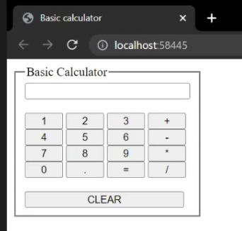

# Basic-Calculator

## Requirements
1. Use AJAX (Asynchronous Javascript and XML)
2. Frontend-Backend use ASP.NET MVC (Mode-View-Controller)
3. At least 2 number calculate at a time

*picture of teacher requirement*

## Keywords
- ASP.NET (Framework, Core)
- ASP.NET MVC (From Razor, MVC, Blazor)
- XML
- XMLHttpRequest
- AJAX

## References
- [รู้จักเอแจ๊กซ์ (AJAX) และการใช้งาน](https://sysadmin.psu.ac.th/2020/07/28/%E0%B8%A3%E0%B8%B9%E0%B9%89%E0%B8%88%E0%B8%B1%E0%B8%81%E0%B9%80%E0%B8%AD%E0%B9%81%E0%B8%88%E0%B9%8A%E0%B8%81%E0%B8%8B%E0%B9%8C-ajax-%E0%B9%81%E0%B8%A5%E0%B8%B0%E0%B8%81%E0%B8%B2%E0%B8%A3%E0%B9%83/#:~:text=AJAX%20%E0%B8%A2%E0%B9%88%E0%B8%AD%E0%B8%A1%E0%B8%B2%E0%B8%88%E0%B8%B2%E0%B8%81%E0%B8%84%E0%B8%B3,%E0%B9%81%E0%B8%AD%E0%B8%9B%E0%B8%9E%E0%B8%A5%E0%B8%B4%E0%B9%80%E0%B8%84%E0%B8%8A%E0%B8%B1%E0%B8%99)
- [XMLHttpRequest](https://developer.mozilla.org/en-US/docs/Web/API/XMLHttpRequest)

## Brief Explaination
### AJAX Brief
- It's like when you only want to update only section of the page (not the whole page). AJAX will come in handy.
- It's not a language, it's like a technic how to reduce bandwidth load when update something often.
### AJAX Usecase
- Facebook news feed, when scroll down and news feed keep updating only 1 section, not the whole long enormous page (if it does, consume more banwidth, this consider as bad practice).
- Google search engine, searchbar when typing something and keep suggest.